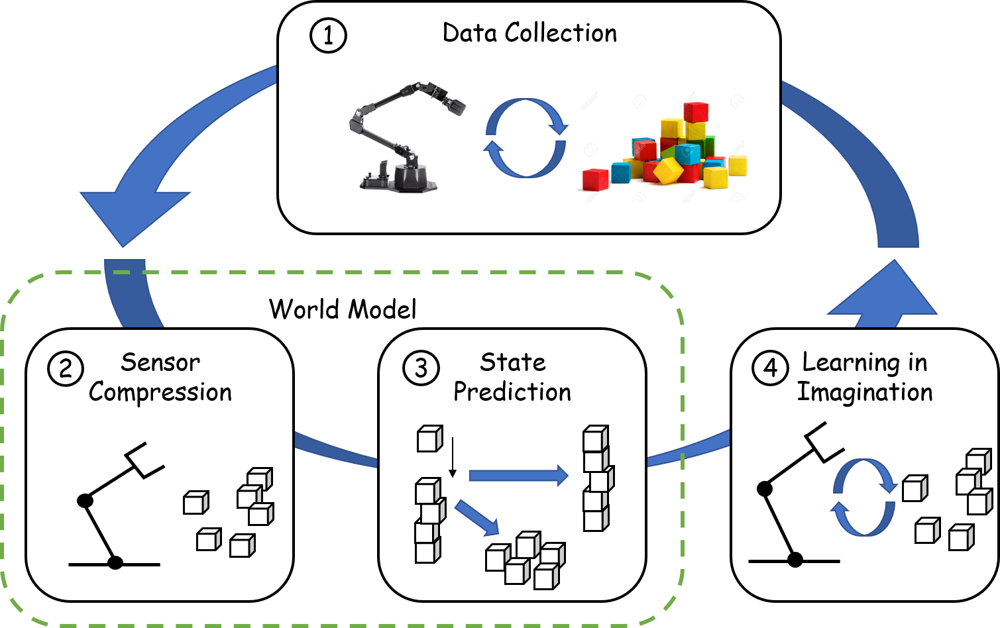

# General Intelligent Machine (GEM)
## Overview

## Setup
Recommend to setup with Anaconda
```bash
# In your virtual environment
git clone --recurse https://github.com/IcarusWizard/GEM
cd GEM
# Install other dependencies
pip install -r requirement.txt
# Reinstall tensorboard
pip unistall tb-nightly tensorboard
pip install tb-nightly
```
